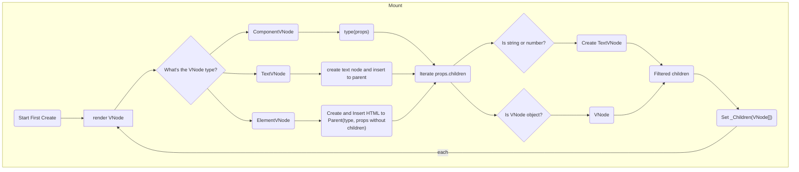
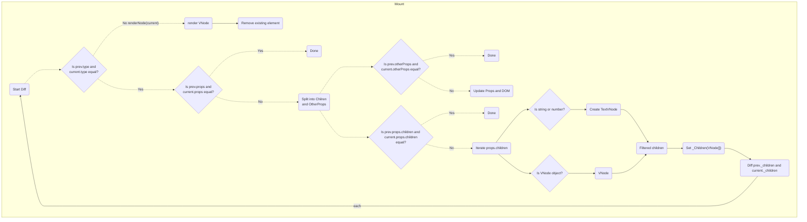

```mermaid
flowchart TD
subgraph Mount  
  firstCreate(Start First Create)
  renderVNode[render VNode]
  checkVNodeType{What's the VNode type?}
  elementVNode(ElementVNode)
  componentVNode(ComponentVNode)
  invokeTypeFn("type(props)")
  textNode(TextVNode)
  insertTextNode(create text node and insert to parent)
  insertToParent("Create and Insert HTML to <br> Parent(type, props without children)" )
  

  firstCreate --> renderVNode
  renderVNode --> checkVNodeType
  checkVNodeType --> elementVNode
  checkVNodeType --> componentVNode
  componentVNode --> invokeTypeFn
  invokeTypeFn --> iterateChildren
  checkVNodeType --> textNode
  textNode --> insertTextNode
  insertTextNode --> iterateChildren
  elementVNode --> insertToParent
  insertToParent --> iterateChildren 
  
  
  iterateChildren(Iterate props.children)
  checkChildrenType{Is string or number?}
  createTextVNode(Create TextVNode)
  checkVNodeObject{Is VNode object?}
  vNodeObject(VNode)
  filteredChildren(Filtered children)
  setChildren("Set _Children(VNode[])")

  iterateChildren --> checkChildrenType
  iterateChildren --> checkVNodeObject
  checkChildrenType --> createTextVNode
  checkVNodeObject --> vNodeObject
  createTextVNode --> filteredChildren
  vNodeObject --> filteredChildren
  filteredChildren --> setChildren
  setChildren --each--> renderVNode

end  
```

```mermaid
flowchart TD
subgraph Mount 
  diff(Start Diff)
  checkType{Is prev.type and <br> current.type equal?}
  checkProps{Is prev.props  and <br> current.props equal?}
  return(Done)
  split(Split into Chilren <br> and OtherProps)
  checkOtherProps{Is prev.otherProps  and <br> current.otherProps equal?}
  checkOtherPropsDone(Done)
  updateProps(Update Props and  DOM)
  checkPropsChildren{Is prev.props.children and <br> current.props.children equal?}
  iterateChildDone(Done)
  diffChildren("Diff prev._children and current._children")
  renderVNode(render VNode)
  removeNode(Remove existing element)
  
  diff -..-> checkType
  checkType -..-> |"No renderNode(current)"| renderVNode
  renderVNode --> removeNode
  checkType -..-> |Yes| checkProps
  checkProps -..-> |Yes| return
  checkProps -..-> |No| split
  split -..-> checkOtherProps
  checkOtherProps -..-> |Yes| checkOtherPropsDone
  checkOtherProps -..-> |No| updateProps
  split -..-> checkPropsChildren
  checkPropsChildren -..-> |Yes| iterateChildDone
  checkPropsChildren -..-> |No| iterateChildren
  
  
  iterateChildren(Iterate props.children)
  checkChildrenType{Is string or number?}
  createTextVNode(Create TextVNode)
  checkVNodeObject{Is VNode object?}
  vNodeObject(VNode)
  filteredChildren(Filtered children)
  setChildren("Set _Children(VNode[])")

  iterateChildren --> checkChildrenType
  iterateChildren --> checkVNodeObject
  checkChildrenType --> createTextVNode
  checkVNodeObject --> vNodeObject
  createTextVNode --> filteredChildren
  vNodeObject --> filteredChildren
  filteredChildren --> setChildren
    
  setChildren --> diffChildren
  diffChildren --each--> diff
  
end  
```
