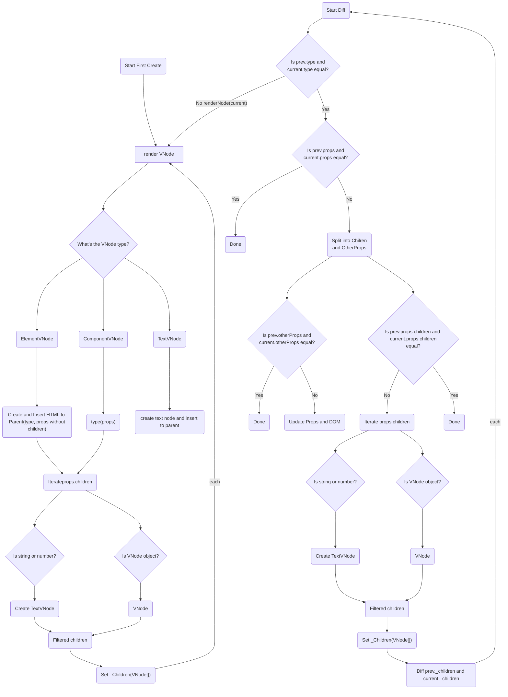

```mermaid
graph TD
  VNode[render VNode] --> B{What's the VNode type? }
  B --> C(ElementVNode)
  B --> D(ComponentVNode)
  D --> D1("type(props)")
  D1 --> G
  B --> E(TextVNode)
  E --> E1(create text node and insert to parent)
  C --> F("Create and Insert HTML to <br> Parent(type, props without children)" )
  F --> G(Iterateprops.children) 
  G --> H{Is string or number?}
  H --> I(Create TextVNode)
  G --> J{Is VNode object?}
  J --> K(VNode)
  I --> L(Filtered children)
  K --> L
  L --> M("Set _Children(VNode[])")
  M --> |each| VNode
  
  firstCreate(Start First Create) --> VNode
  
  diff(Start Diff) --> checkType{Is prev.type and <br> current.type equal?}
  checkType --> |"No renderNode(current)"| VNode
  checkType --> |Yes| checkProps{Is prev.props  and <br> current.props equal?}
  checkProps --> |Yes| return(Done)
  checkProps --> |No| split(Split into Chilren <br> and OtherProps)
  split --> checkOtherProps{Is prev.otherProps  and <br> current.otherProps equal?}
  checkOtherProps --> |Yes| done(Done)
  checkOtherProps --> |No| updateProps(Update Props and  DOM)
  split --> checkPropsChildren{Is prev.props.children and <br> current.props.children equal?}
  checkPropsChildren --> |No| iterateChild(Iterate  props.children)
  checkPropsChildren --> |Yes| d(Done)
  iterateChild --> H1{Is string or number?}
  H1 --> I1(Create TextVNode)
  iterateChild --> J1{Is VNode object?}
  J1 --> K1(VNode)
  I1 --> L1(Filtered children)
  K1 --> L1
  L1 --> M1("Set _Children(VNode[])")
  M1 --> K2("Diff prev._children and current._children")
  K2 --> |each| diff
```
